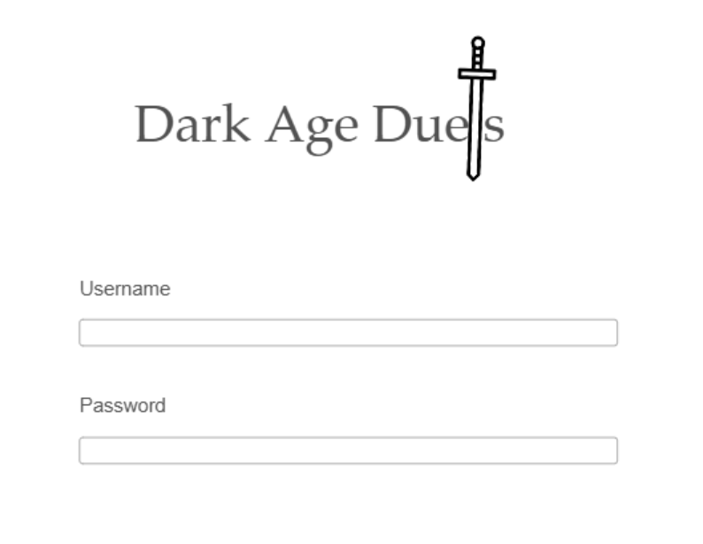
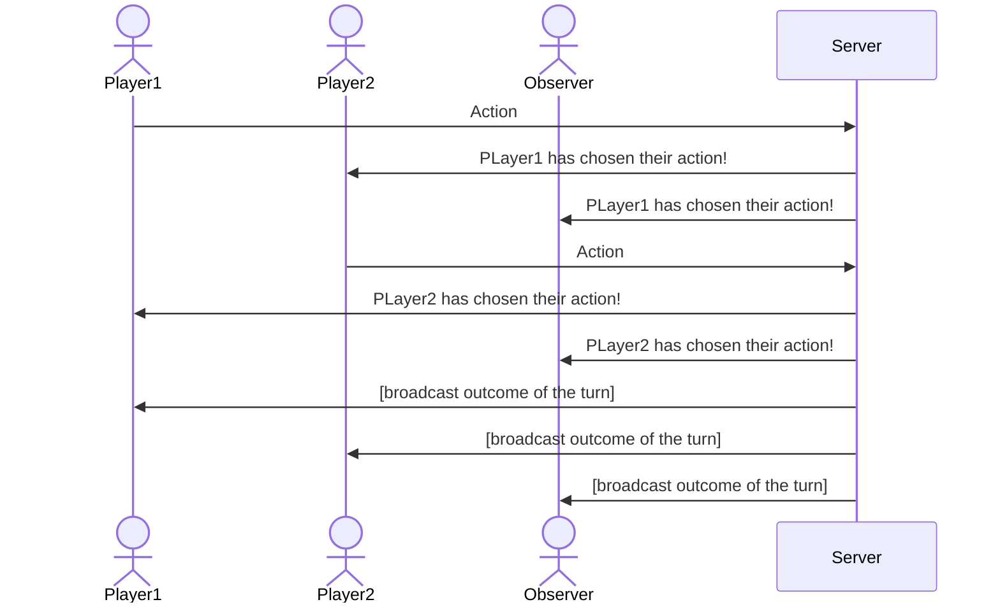

# Dark Age Duels

[My Notes](notes.md)

A full-stack web application in which two players duel in turn-based combat as their selected classes.

> [!NOTE]
> This is a template for your startup application. You must modify this `README.md` file for each phase of your development. You only need to fill in the section for each deliverable when that deliverable is submitted in Canvas. Without completing the section for a deliverable, the TA will not know what to look for when grading your submission. Feel free to add additional information to each deliverable description, but make sure you at least have the list of rubric items and a description of what you did for each item.

## 🚀 Specification Deliverable

> [!NOTE]
> Fill in this sections as the submission artifact for this deliverable. You can refer to this [example](https://github.com/webprogramming260/startup-example/blob/main/README.md) for inspiration.

For this deliverable I did the following. I checked the box `[x]` and added a description for things I completed.

- [x] Proper use of Markdown
- [x] A concise and compelling elevator pitch
- [x] Description of key features
- [x] Description of how you will use each technology
- [x] One or more rough sketches of your application. Images must be embedded in this file using Markdown image references.

### 🛗 Elevator pitch

Tic tac toe can get a little boring, but playing more complex games like league of legends or games that require intense study like chess can seem pretty overwhelming. If you want a way to prove your dominance over your friends without the time commitment of improving mechanical skills or the study and memorization of patterns, then Dark Age Duels is the game for you! Simple medieval-themed classes and attacks provide a simple yet entertaining head-to-head duel where outsmarting your opponent is the key to victory!

### 📝 Design

Here is a sequence diagram that represents how the two players and the observer send and receive information from the backend during a turn.

### 🔑 Key features

- Secure registration and login using HTTPS
- Ability to create and join a match as a certain class of warrior
- Ability to interact with the other player in your match in turn-based combat
- Display of your character and the opponents character, as well as your available moves that turn
- Health/mana totals displayed
- Win/Loss ratio persistently stored
- Ability to watch a match as an observer
- Receive an update when your opponent has selected their action for that turn
- Receive an update when the turn is evaluated which displays the change in life/mana totals for you and your opponent and the actions used by both.
- Ability to forfeit a match

### 💻 Technologies

I am going to use the required technologies in the following ways.

- **HTML** - Uses correct HTML structure. Three HTML pages - one for login/registering, one for match selection, and one for gameplay.
- **CSS** - Application styling that places all information in an easily accessible, readable location on any device. medieval-styled color theme.
- **React** - Used to direct routing from login to match selection and from match selection to gameplay. Displays actions during gameplay. Enables match selection.
- **Service** - Backend service with endpoints for:
  - login/register
  - retrieving the list of matches
  - creating a new match
  - joining a match
  - logout 
- **DB/Login** - database stores users and their win/loss counter, and matches. login data matched with data in database, which securely stores passwords. 
- **WebSocket** - Broadcasts when a player locks in the action for that turn, and broadcasts the results of the turn when both players have chosen their actions.

## 🚀 AWS deliverable

For this deliverable I did the following. I checked the box `[x]` and added a description for things I completed.

- [x] **Server deployed and accessible with custom domain name** - [Dark Age Duels](http://darkageduels.click).

## 🚀 HTML deliverable

For this deliverable I did the following. I checked the box `[x]` and added a description for things I completed.

- [x] **HTML pages** - I created three separate HTML pages. One for login, one for the game select menu, and one for gameplay.
- [x] **Proper HTML element usage** - I made use of various HTML elements throughout my project and ensured that the syntax fit proper HTML convention and format.
- [x] **Links** - Each html page has a link to each other page, as well as buttons that will link to the other html pages.
- [x] **Text** - Explanatory and decorative text is used throughout the HTML pages.
- [x] **3rd party API placeholder** - The index.html page holds a placeholder where videogame deals will be displayed to users, retreived from CheapShark API.
- [x] **Images** - I used images in the play.html page where the character pictures will eventually go.
- [x] **Login placeholder** - I created text input boxes to indicate where the username and password should be input. There is a login/register button that takes the user to the main menu page. The password text box obfuscates text entered into it so as to not reveal the password.
- [x] **DB data placeholder** - the main menu shows a leaderboard and a list of games built from data stored in the database.
- [x] **WebSocket placeholder** - Gameplay has a readonly textarea html element which contains sample websocket communication messages.

## 🚀 CSS deliverable

For this deliverable I did the following. I checked the box `[x]` and added a description for things I completed.

- [x] **Visually appealing colors and layout. No overflowing elements.** - I made it look pretty :)
- [x] **Use of a CSS framework** - I used bootstrap for my header menu
- [x] **All visual elements styled using CSS** - Was there any other option to style visual elements?
- [x] **Responsive to window resizing using flexbox and/or grid display** - I used flex for most of it (turns out grid was easier for the buttons so in play.css I used both)
- [x] **Use of a imported font** - I imported Modern Antiqua for a pretty medieval-style font
- [x] **Use of different types of selectors including element, class, ID, and pseudo selectors** - I used all sorts of selectors, turns out they make life easy!

## 🚀 React part 1: Routing deliverable

For this deliverable I did the following. I checked the box `[x]` and added a description for things I completed.

- [x] **Bundled using Vite** - All bundled! installed vite and everything!
- [x] **Components** - I went ahead and compartmentalized my project to have better structure
- [x] **Router** - Each link now routes the html to a different set of elements rather than going to a new file!

## 🚀 React part 2: Reactivity deliverable

For this deliverable I did the following. I checked the box `[x]` and added a description for things I completed.

- [ ] **All functionality implemented or mocked out** - I did not complete this part of the deliverable.
- [ ] **Hooks** - I did not complete this part of the deliverable.

## 🚀 Service deliverable

For this deliverable I did the following. I checked the box `[x]` and added a description for things I completed.

- [ ] **Node.js/Express HTTP service** - I did not complete this part of the deliverable.
- [ ] **Static middleware for frontend** - I did not complete this part of the deliverable.
- [ ] **Calls to third party endpoints** - I did not complete this part of the deliverable.
- [ ] **Backend service endpoints** - I did not complete this part of the deliverable.
- [ ] **Frontend calls service endpoints** - I did not complete this part of the deliverable.
- [ ] **Supports registration, login, logout, and restricted endpoint** - I did not complete this part of the deliverable.

## 🚀 DB deliverable

For this deliverable I did the following. I checked the box `[x]` and added a description for things I completed.

- [ ] **Stores data in MongoDB** - I did not complete this part of the deliverable.
- [ ] **Stores credentials in MongoDB** - I did not complete this part of the deliverable.

## 🚀 WebSocket deliverable

For this deliverable I did the following. I checked the box `[x]` and added a description for things I completed.

- [ ] **Backend listens for WebSocket connection** - I did not complete this part of the deliverable.
- [ ] **Frontend makes WebSocket connection** - I did not complete this part of the deliverable.
- [ ] **Data sent over WebSocket connection** - I did not complete this part of the deliverable.
- [ ] **WebSocket data displayed** - I did not complete this part of the deliverable.
- [ ] **Application is fully functional** - I did not complete this part of the deliverable.
